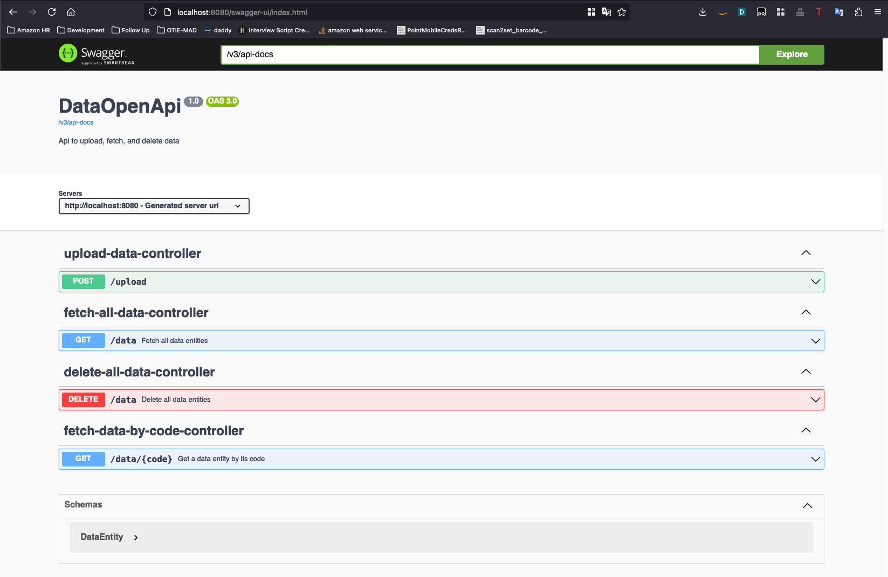
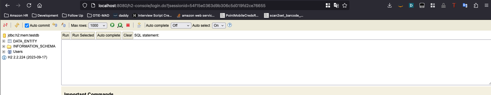

# Data Entity Management Application

This Spring Boot application provides a RESTful API for managing data entities. It offers features for uploading CSV data and performing basic CRUD operations on the entities.

## Table of Contents

1. [Project Overview](#project-overview)
2. [Features](#features)
3. [Project Structure](#project-structure)
4. [Running the Application](#running-the-application)
5. [Running Tests](#running-tests)
6. [API Documentation](#api-documentation)
7. [Database Access](#database-access)
8. [Future To Dos](#future-to-dos)

## Project Overview

The Data Entity Management Application is designed to simplify the process of managing data entities through a RESTful API. It allows users to upload CSV data, perform CRUD operations, and interact with the stored entities.
API can be interacted with at **[http://localhost:8080/swagger-ui/index.html](http://localhost:8080/swagger-ui/index.html)** once running

## Features
This is a Java Spring Boot application with an in memory H2 database, set up to expose a few REST endpoints to interact with Data Entities. A few of the features are: 
- CSV data upload functionality to populate data in database
- RESTful API for fetching. reading, and deleting data entities
- A Swagger UI to interact with the API at **[http://localhost:8080/swagger-ui/index.html](http://localhost:8080/swagger-ui/index.html)**
- H2 Database console if you're so inclined to look at the database yourself

## Project Structure

The project contains a few important packages as noted below:

- config: simple set up for openapi/swagger UI
- controllers: Contains definitions and REST Endpoints business logic
- models: Just contains the model for the Data Entity
- repositories: very simple data entity repository to interact with H2 database
- services: contains the business logic to interact with the H2 database
- test: A bunch of unit tests for the above packages

## Running the Application

1. Clone the repository:
2. Navigate to the project directory:
3. Run the application:
- If on a Mac, you can run ```./mvnw spring-boot:run```
- If on a Windows, you can run ```mvnw.cmd spring-boot:run```


## Running Tests

1. Clone the repository:
2. Navigate to the project directory:
3. Run the tests:
- If on a Mac, you can run ```./mvnw test```
- If on a Windows, you can run ```mvnw.cmd test```


## API Documentation

1. Run the application using the above "Running the Application" section
2. Access the swagger UI at [http://localhost:8080/swagger-ui/index.html](http://localhost:8080/swagger-ui/index.html) You should see a console like the one below


## Database Access

This application uses an H2 in-memory database for development and testing purposes. You can access the H2 console to view and interact with the database directly. Here's how to do it:

1. Start the application using the instructions in the "Running the Application" section.

2. Once the application is running, open a web browser and navigate to:
   http://localhost:8080/h2-console

3. You should see the H2 Console login page. Use the following default settings:
    - Driver Class: org.h2.Driver
    - JDBC URL: jdbc:h2:mem:testdb
    - User Name: sa
    - Password: [leave this field empty]

4. Click "Connect" to access the console. Once connected, you should see a console like this
   

Remember that since this is an in-memory database, all data will be lost when you stop the application. The database is recreated each time you start the application.

## Future To Dos
Due to time constraints, I did not get to everything I would have liked to. Here are a few things I could have worked on if had more time
- Security for end points. Right now they're completely unsecured.
- Better data validation and error handling. The logic currently just catches generic exceptions and returns 500s, there could be more robust input validation, especially around csv parsing and saving to the database.
- Better Testing. There's currently only some unit tests, those can be extended as well as adding integration tests.